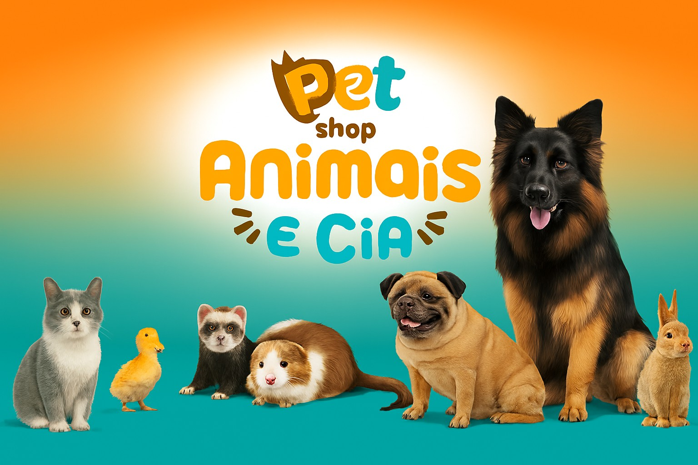

# 🐾 Ultima-Python-Developer-Project



[](https://github.com/Rogerio5/Ultima-Python-Developer-Project)
[](LICENSE)

---

## 📋 Índice / Table of contents

- [📖 Descrição / Description](#📖-descrição--description)
- [⚙️ Funcionalidades / Features](#⚙️-funcionalidades--features)
- [🏗️ Arquitetura / Architecture](#🏗️-arquitetura--architecture)
- [🚀 Execução / Execution](#🚀-execução--execution)
- [🌐 Acesso / Access](#🌐-acesso--access)
- [🧰 Tecnologias / Technologies](#🧰-tecnologias--technologies)
- [📂 Estrutura de pastas / Folder structure](#📂-estrutura-de-pastas--folder-structure)
- [🔗 Rotas principais / Main routes](#🔗-rotas-principais--main-routes)
- [👨‍💻 Desenvolvedor / Developer](#👨‍💻-desenvolvedor--developer)
- [📜 Licença / License](#📜-licença--license)
- [🏁 Conclusão / Conclusion](#🏁-conclusão--conclusion)

---

## 📖 Descrição / Description

**PT:**
- Projeto desenvolvido como atividade de Projeto da **Ultima.School**  
- Objetivo: criar um sistema completo de **gestão de agendamentos para um Petshop**  
- Principais recursos:
  - 🔐 Autenticação de administrador  
  - 🛠️ Painel administrativo  
  - ⚡ Interatividade via **Flask + JavaScript**  
  - 📅 Fluxo de login, cadastro e listagem de reservas  
  - 🔄 Atualização de status das reservas  
  - 🗑️ Reset do banco de dados via **script** ou **CLI**  

**EN:**
- Project developed as an **Ultima.School** Project activity  
- Goal: build a complete **Petshop scheduling management system**  
- Main features:
  - 🔐 Admin authentication  
  - 🛠️ Admin panel  
  - ⚡ Interactivity using **Flask + JavaScript**  
  - 📅 Admin login, reservation creation and listing  
  - 🔄 Reservation status updates  
  - 🗑️ Database reset via **script** or **CLI**  

---

## ⚙️ Funcionalidades / Features

| 🧩 Funcionalidade (PT)                      | 💡 Description (EN)                        |
|---------------------------------------------|--------------------------------------------|
| 🔐 Login de administrador                   | 🔐 Admin login                              |
| 📅 Agendamento de banhos/tosas              | 📅 Grooming/bathing scheduling              |
| 📋 Listagem de reservas por data            | 📋 Reservation listing by date              |
| 🛠️ Painel admin para atualizar status       | 🛠️ Admin panel to update reservation status |
| 🗑️ Reset do banco via script ou CLI         | 🗑️ Database reset via script or CLI         |
| 🧾 Relatórios básicos (banhos por categoria)| 🧾 Basic reports (groomings per category)   |
| 🎨 Templates com Bootstrap                  | 🎨 Templates styled with Bootstrap          |

---

## 🏗️ Arquitetura / Architecture

- **Backend:** Flask, Blueprints, CLI customizada para tarefas de banco  
- **Banco de dados:** SQLite com tabelas para usuários e reservas  
- **Frontend:** Bootstrap + JavaScript para interações no painel  
- **Autenticação:** Sessões com proteção de rotas administrativas  
- **Scripts:** `reset_db.py` e comando `flask reset-db` para reinitialização  

---

## 🚀 Execução / Execution

### T-BR

```bash
# Clonar repositório
git clone https://github.com/Rogerio5/Ultima-Python-Developer-Project.git
cd Ultima-Python-Developer-Project

# Criar ambiente virtual e instalar dependências
python -m venv .venv
source .venv/bin/activate  # Windows: .venv\Scripts\activate
pip install -r requirements.txt

# Reiniciar o banco de dados
python reset_db.py
# ou
flask reset-db

# Executar o servidor
python run.py

Acesse no navegador: URL: http://127.0.0.1:5000/login Usuário: admin Senha: admin
```

### EN
```bash
# Clone repository
git clone https://github.com/Rogerio5/Ultima-Python-Developer-Project.git
cd Ultima-Python-Developer-Project

# Create virtual environment and install dependencies
python -m venv .venv
source .venv/bin/activate  # Windows: .venv\Scripts\activate
pip install -r requirements.txt

# Reset database
python reset_db.py
# or
flask reset-db

# Run server
python run.py

Access in browser: URL: http://127.0.0.1:5000/login User: admin Pass: admin
```
---

## 🌐 Acesso / Access

- [🔗 Repositório GitHub / GitHub Repository](https://github.com/Rogerio5/Ultima-Python-Developer-Project)

---

## 🧰 Tecnologias / Technologies

| Tecnologia | Ícone |
|------------|-------|
| **Python** |  |
| **Flask** |  |
| **SQLite** |  |
| **Bootstrap** |  |
| **JavaScript** |  |

---

## 👨‍💻 Desenvolvedor / Developer

- [Rogerio](https://github.com/Rogerio5)

---

## 📜 Licença / License

Este projeto está sob licença MIT. Para mais detalhes, veja o arquivo `LICENSE`.  

This project is under the MIT license. For more details, see the `LICENSE` file.

---

🏁 Conclusão / Conclusion

PT: Este projeto demonstra como construir um sistema web completo com Flask, integrando autenticação, banco de dados, templates e interatividade com JavaScript. Ele vai além do exercício, aplicando boas práticas de organização e usabilidade.

EN: This project shows how to build a complete Flask web system, integrating authentication, database, templating, and JavaScript interactivity. It goes beyond the exercise, applying good practices for organization and usability.

